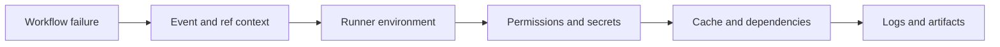

# Debugging flow map

Use this map as a triage order so CI debugging starts with the environment that shaped the failure.

```mermaid
flowchart LR
  A["Workflow failure"] --> B["Event and ref context"]
  B --> C["Runner environment"]
  C --> D["Permissions and secrets"]
  D --> E["Cache and dependencies"]
  E --> F["Logs and artifacts"]
```
